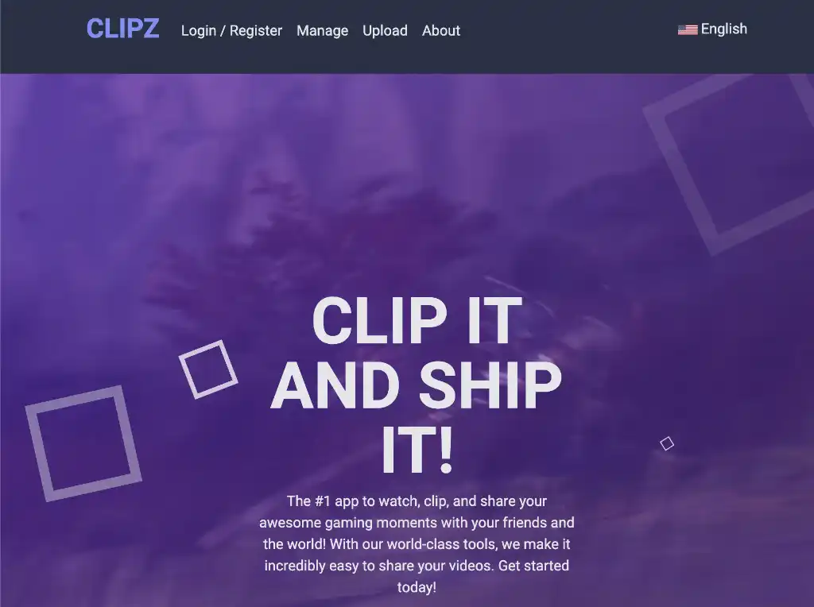

# Clips

This is the main project from the course [Complete Angular Developer, Zero to Mastery](https://zerotomastery.io/courses/learn-angular). This course really improves my Angular skills in general and especially when it comes to RxJS. Working with API's is such an important part of front-end development. 

Other parts of this course include TypeScript, authentication, custom validators, routing, file upload and more. It's so great, I can take it all into practice in one of my freelance projects in which I collaborate with lead-developer [Garanas](https://github.com/Garanas) and a team of back-enders.

This project was generated with [Angular CLI](https://github.com/angular/angular-cli) version 15.2.2.

